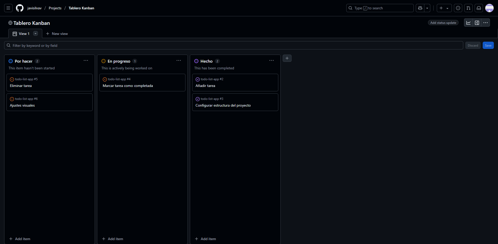
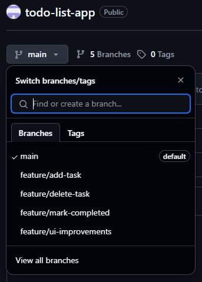
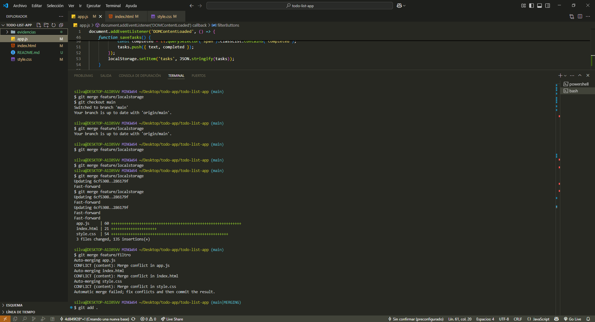

# 📝 To-Do List App

Una aplicación web simple de lista de tareas (To-Do List) desarrollada con HTML, CSS y JavaScript, enfocada en la práctica de flujos de trabajo con Git y GitHub.

---

## 🚀 Funcionalidades principales

- Añadir tareas dinámicamente
- Marcar tareas como completadas
- Eliminar tareas
- **Guardar tareas en localStorage** (persistencia de datos)
- **Filtrar tareas por estado**: Todas | Completadas | Pendientes

---

## 🧠 Tecnologías utilizadas

- HTML5
- CSS3
- JavaScript (Vanilla)
- Git y GitHub
- Visual Studio Code

---

## ⚙️ Instalación

1. Clona este repositorio:
   ```bash
   git clone https://github.com/javisilvav/todo-list-app.git
   cd todo-list-app
   ```

2. Abre el proyecto en Visual Studio Code:
   ```bash
   code .
   ```

3. Abre `index.html` en tu navegador o usa Live Server.

---

## 🧪 Comandos Git utilizados

| Propósito                 | Comando                                   |
|--------------------------|-------------------------------------------|
| Inicializar repositorio  | `git init`                                |
| Agregar archivos         | `git add .`                               |
| Commit de cambios        | `git commit -m "mensaje"`                 |
| Crear ramas              | `git checkout -b feature/nombre`         |
| Cambiar de rama          | `git checkout main`                       |
| Fusionar ramas           | `git merge feature/nombre`               |
| Resolver conflictos      | Edición manual + `git add` + `commit`     |
| Enviar al repositorio    | `git push origin main`                    |
| Traer cambios remotos    | `git pull origin main --rebase`          |

---

## 🌳 Flujo de trabajo con ramas

Se trabajó con el siguiente flujo:

1. Rama `main`: rama principal del proyecto.
2. Rama `feature/add-task`: desarrollo de la funcionalidad de agregar tareas.
3. Rama `feature/delete-task`: implementación de eliminación de tareas.
4. Rama `feature/mark-completed`: implementación de funcionalidad para marcar una tarea como completada.
5. Rama `feature/ui-improvements`: desarollo de mejoras visuales al proyecto.
6. Rama `feature/localstorage`: agrega persistencia de tareas.
7. Rama `feature/filtro`: permite filtrar tareas según su estado.
8. Se fusionaron ambas ramas en `main` mediante `git merge`.

---

## 📦 Organización del proyecto

```
todo-list-app/
├── index.html
├── style.css
├── app.js
├── README.md
└── evidencias/
    ├── kanban.png
    ├── ramas.png
    ├── vscode.png
    └── historial-commits.png
```

---

## 📸 Evidencias del trabajo (capturas)

- ✔️ Kanban board en GitHub Projects

- ✔️ Uso de ramas y merge

- ✔️ Historial de commits

- ✔️ Visual Studio Code conectado a GitHub

- ✔️ Pull/push en terminal


---

## 🧠 Aprendizajes

Este proyecto me permitió aplicar comandos de Git y prácticas de versionamiento reales, incluyendo resolución de conflictos, manejo de ramas, uso de GitHub Projects (Kanban), y documentación de procesos.

---

## 📬 Contacto

**Javiera Silva**  
[GitHub](https://github.com/javisilvav)
